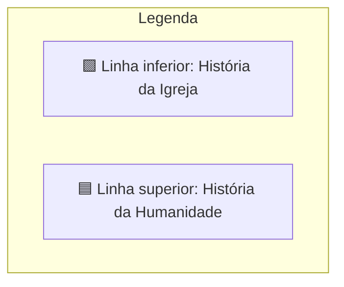
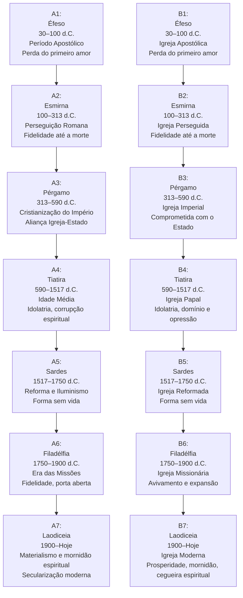
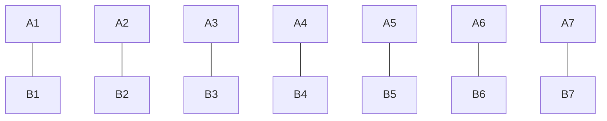
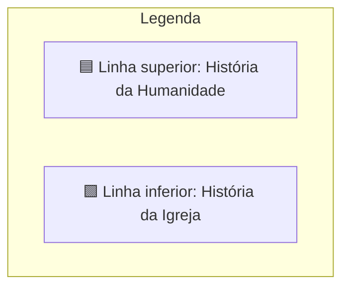
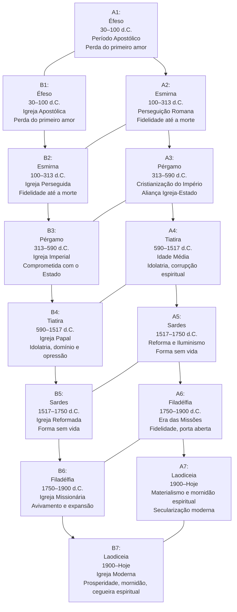

# 📜 Análise Profética das Sete Igrejas no Livro de Apocalipse

## 📖 Introdução
Este documento traz uma análise comparativa e profética das **Sete Igrejas do Apocalipse** (Apocalipse 2–3), correlacionando-as com:

- 🕰️ **Períodos da História da Humanidade após Cristo**  
- ⛪ **Períodos da História da Igreja Cristã até os dias atuais**

O objetivo é identificar **padrões, paralelos e repetições proféticas**, conforme interpretado por estudiosos e teólogos ao longo dos séculos.

---

# 🔗 Linha Cronológica e Paralelos das Sete Igrejas

