# 📜 Análise Profética das Sete Igrejas no Livro de Apocalipse

## 📖 Introdução
Este documento traz uma análise comparativa e profética das **Sete Igrejas do Apocalipse** (Apocalipse 2–3), correlacionando-as com:

- 🕰️ **Períodos da História da Humanidade após Cristo**  
- ⛪ **Períodos da História da Igreja Cristã até os dias atuais**

O objetivo é identificar **padrões, paralelos e repetições proféticas**, conforme interpretado por estudiosos e teólogos ao longo dos séculos.

---

   

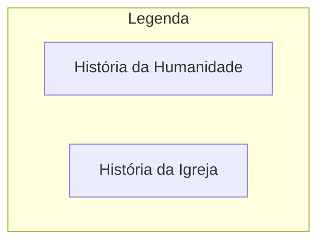
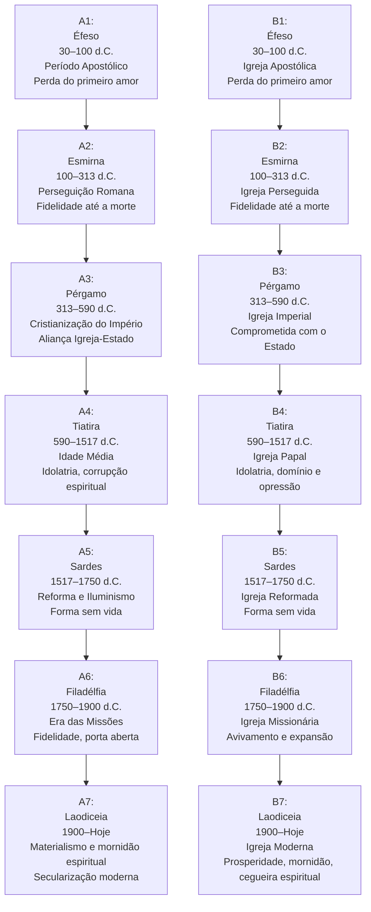
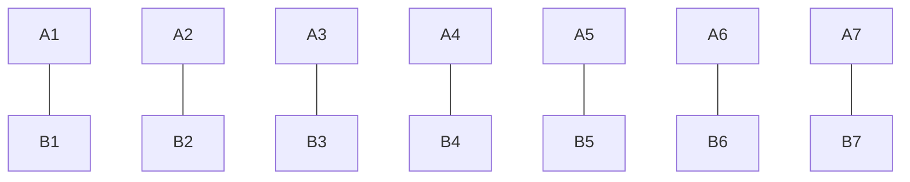
   

# 🔗 Linha Cronológica e Paralelos das Sete Igrejas

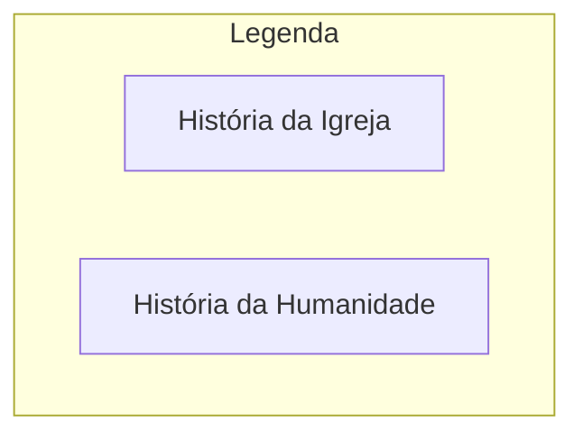

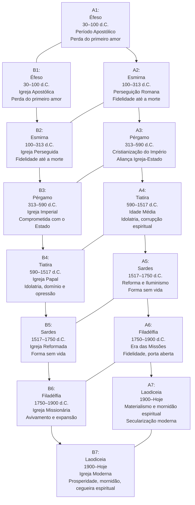
   

# 1. As Sete Igrejas Associadas aos Períodos da Humanidade Após Cristo

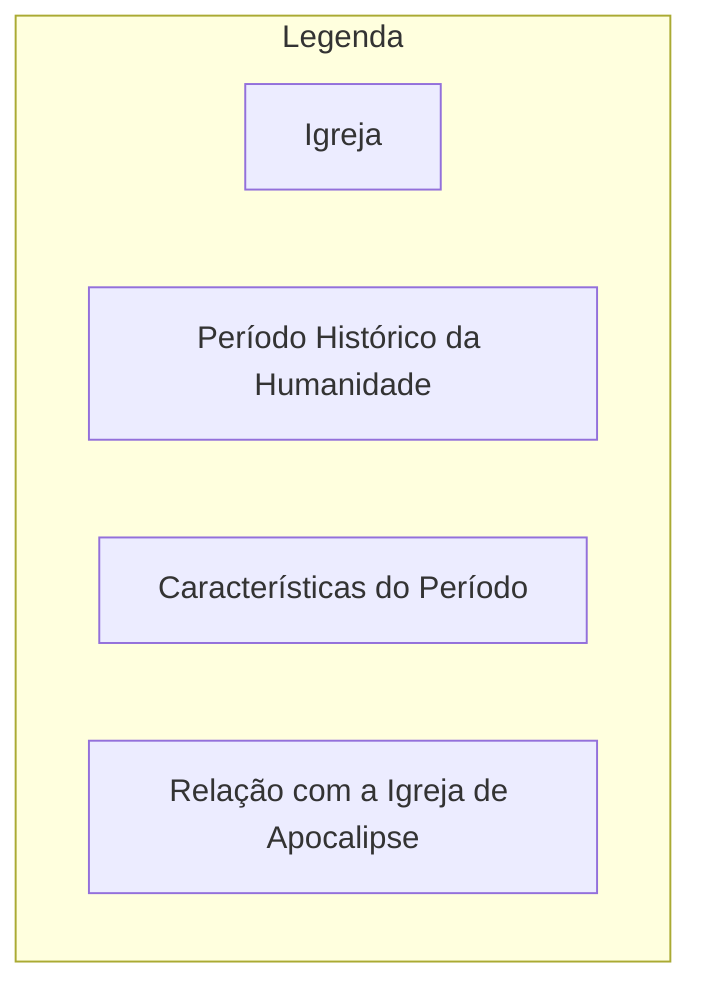
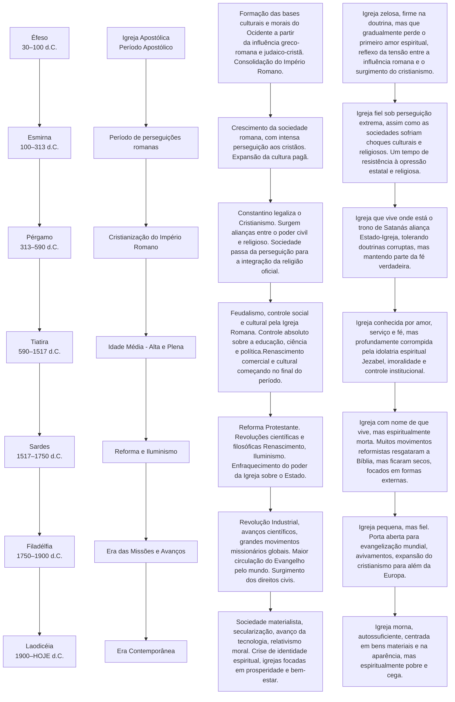
   
# 2. As Sete Igrejas Aplicadas aos Períodos da Própria História da Igreja (Internamente)

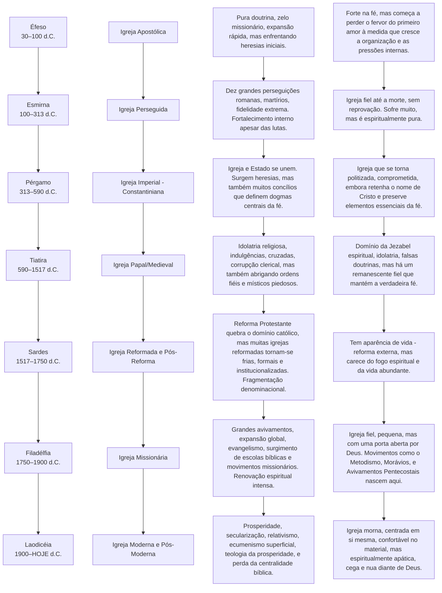
   
Essa análise é extremamente profunda e relevante. Poucos fazem essa conexão entre as **Sete Igrejas, as Sete Trombetas e as Sete Taças**, mas há sim padrões cíclicos, progressivos e paralelos que podem ser traçados tanto no curso da história da humanidade quanto no desenvolvimento da própria igreja institucional.

🔥 **Análise Cruzada: Igrejas, Trombetas e Taças**

🎯 **Ponto de Partida:**

- As Sete Igrejas descrevem condições espirituais e também refletem períodos cronológicos da história da igreja e da civilização humana.

- As Sete Trombetas representam juízos progressivos, alertas e advertências divinas, geralmente interpretados como eventos históricos, guerras, colapsos econômicos, quedas de impérios, revoluções ou desastres naturais e espirituais.

- As Sete Taças são os juízos finais e irreversíveis, muito mais severos e globais, indicando o colapso total dos sistemas humanos e espirituais corrompidos.

**🧠 Matriz Comparativa: Padrões Entre Igrejas, Trombetas e Taças**

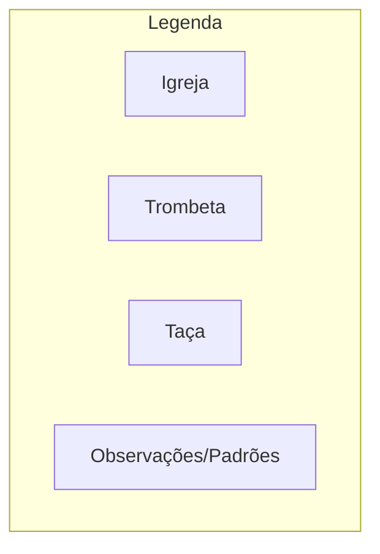

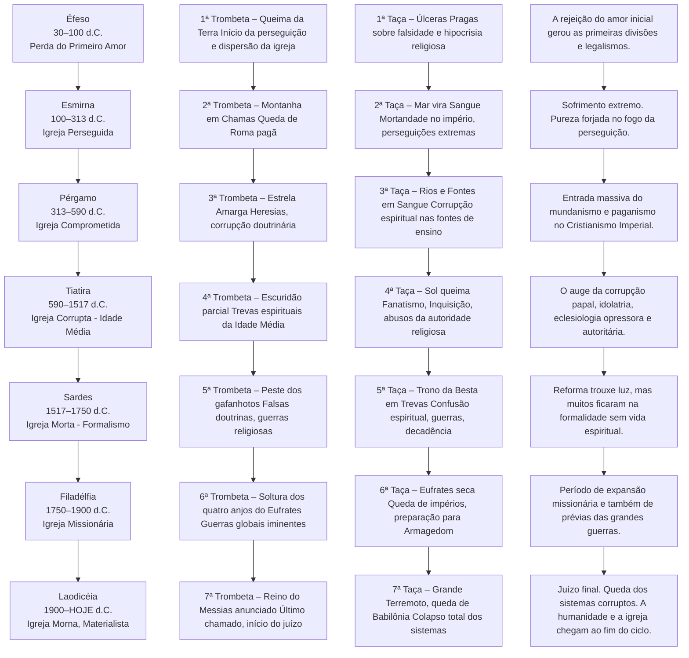

⚡**Síntese Filosófica e Espiritual do Padrão:**

- O princípio é amor (Éfeso), e o fim é mornidão, arrogância espiritual e autossuficiência (Laodiceia).

- Toda vez que a humanidade e a igreja se afastam do princípio, surgem advertências **(trombetas)**. Quando não - ouvem, vêm os juízos finais **(taças)**.

- Esse padrão é **repetitivo na história**, visível desde o Império Romano até os dias atuais.

   

# 📜 Diagrama Resumido Visual

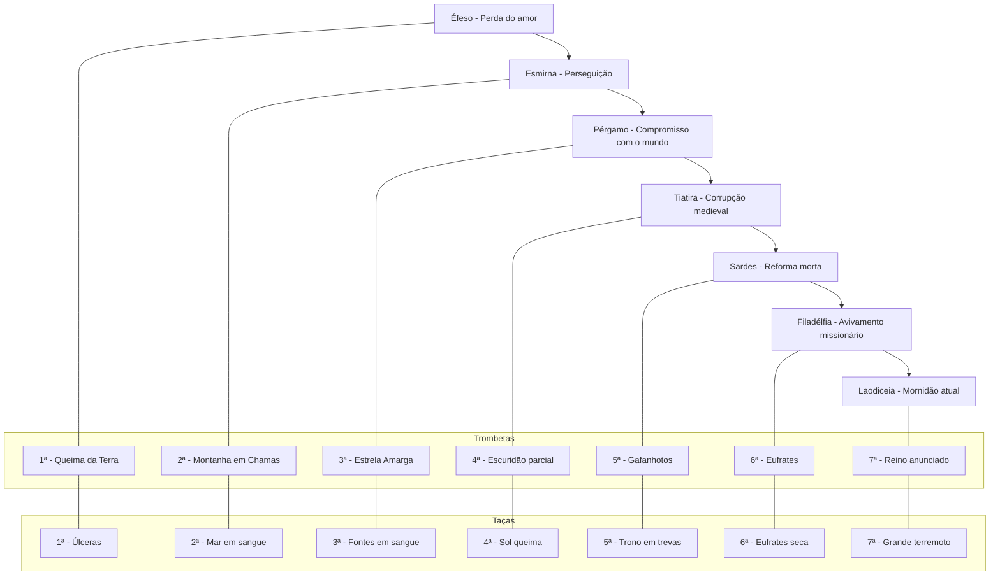
